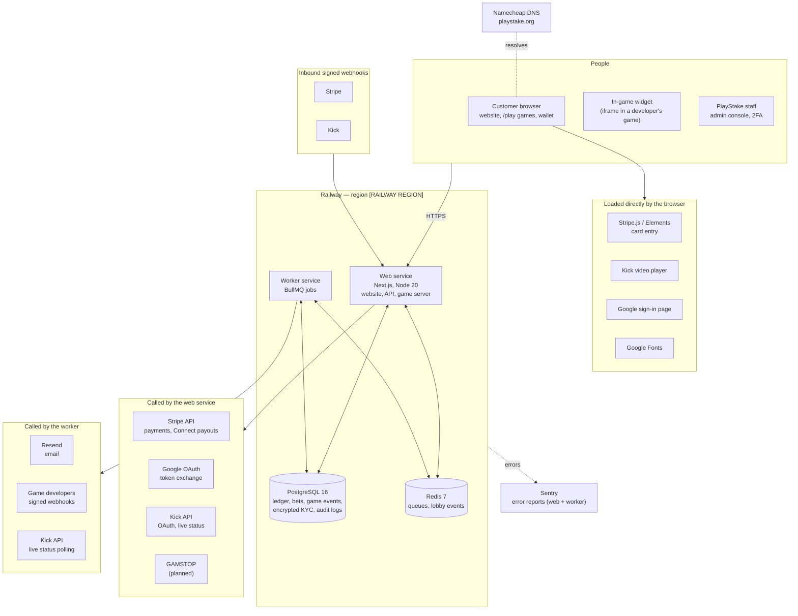

# Document 08 — System Diagram and Outsourcing Map

| | |
|---|---|
| **Operator** | [COMPANY NAME], trading as PlayStake |
| **Owner** | [COMPLIANCE LEAD NAME], Head of Compliance (with engineering) |
| **Version** | 0.1 — draft for licence application |
| **Review** | On any new supplier, hosting change or new product; at least annually |
| **Relates to** | Remote operating licence application: system diagram with commentary; LCCP 15.2.1 key events (outsourcing of key functions); RTS security requirements (Document 13) |

> Draft prepared from the platform as built on 30 September 2026. Items in `[BRACKETS]` must be completed before submission. Where a supplier is "planned", no contract exists yet and the function is not live.

## 1. Purpose

This document gives the Commission a single picture of the PlayStake gambling system: every component, who provides and operates it, where it runs, and how data and money flow between components. It also lists every function we rely on a third party for (the outsourcing map). Document 09 follows a customer through the system end to end. Document 10 maps each activity to its location, provider and operator.

## 2. Summary

PlayStake is a single web application with a separate background-worker process, a PostgreSQL database and a Redis instance. All four are hosted by one provider (Railway). PlayStake writes and operates all of its gambling software itself: game logic, random number generation, the wallet and ledger, result handling, and all compliance controls. No third-party gambling software, game content or platform is used.

Third parties provide: card payments and payouts (Stripe), transactional email (Resend), error monitoring (Sentry), optional sign-in (Google), live-stream integration (Kick), domain name registration and DNS (Namecheap), source control and build checks (GitHub). The national self-exclusion check (GAMSTOP) and dispute resolution (IBAS) are contracted but not yet live.

## 3. System diagram

### 3.1 Commentary

- **One application, two processes.** The web service answers every request from customers, staff and game developers. The worker service runs everything time-based: settlement after the dispute window, expiry of unanswered bets, no-show voiding, dispute escalation, anomaly and harm detection, AML scans, the daily ledger audit, email delivery, outbound webhooks, deposit-limit activation and session cleanup. Both processes are deployed from the same code and connect to the same database.
- **The database is the system of record.** Balances exist only as ledger accounts in PostgreSQL, changed only through a double-entry `transfer()` that writes two balancing entries. Ledger entries, game events, the admin audit log and referee audit events cannot be edited or deleted (database triggers reject it).
- **Games run on our servers.** For every `/play` game, the server holds the rules and state, draws every random outcome (Node.js `crypto.randomInt`, a CSPRNG) and decides the result. The browser only sends what the player did. See Document 11 for testing.
- **Card data never reaches PlayStake.** Card entry uses Stripe Elements, loaded from Stripe, so PlayStake never sees or stores card numbers. Stripe tells us about payments through signed webhooks, which are verified before any balance changes.
- **Redis holds no money and no customer records.** It carries job queues, real-time lobby events and the worker heartbeat. Losing it delays background work; it does not lose funds or records.
- **Identity documents** are stored in PostgreSQL encrypted with AES-256-GCM, under a key held only in the hosting environment. Every staff view is logged.

## 4. Outsourcing map

"Operated by" is who runs the service day to day. "Data shared" is what leaves PlayStake. Every supplier is a key supplier in the sense of LCCP 15.2.1 unless marked otherwise; changes are notified as key events (Document 14).

| Function | Supplier | Status | What they do | Data shared | Where processed | Contract / assurance |
|---|---|---|---|---|---|---|
| **Hosting and storage** | Railway Corp. | Live | Runs the web and worker services, PostgreSQL and Redis; database backups (to be confirmed as enabled, Document 13) | All platform data (hosted, not accessed by Railway for its own purposes) | [RAILWAY REGION]. Confirm and record. | Railway terms and DPA. [CONFIRM SOC 2 REPORT] |
| **Payment services** | Stripe Payments Europe / Stripe, Inc. | Live, **test mode** | Card deposits (Payment Intents), withdrawals via Stripe Connect Express, Radar fraud screening (to configure) | Customer name, email, amount; card data handled by Stripe only | Stripe (EU/US) | Stripe Services Agreement; PCI DSS Level 1 |
| **Age and identity verification** | In-house | Live | Customers upload an identity document; staff review it before any deposit or gambling | — | PlayStake (Railway) | — |
| | [eIDV PROVIDER] | Planned | Electronic identity, age, liveness and document checks | Name, date of birth, address, document images | [TBC] | To contract (Master Manual §8 item 4) |
| **Sanctions and PEP screening** | [SCREENING PROVIDER] | Planned | Screening at verification and on list updates | Name, date of birth, nationality | [TBC] | To contract (Master Manual §8 item 5) |
| **Multi-operator self-exclusion** | GAMSTOP (The National Online Self Exclusion Scheme Ltd) | Planned | Checks every customer against the national register | Name, date of birth, email, postcode | UK | Membership to complete (Master Manual §8 item 3) |
| **Geolocation** | None | **Gap** | No IP-based location check today. Customers state their country at verification. | — | — | See §6 |
| **Fraud detection** | In-house | Live | Anomaly detection (win rates, winner patterns, fast settlement, volume spikes), shared-identity checks, AML scans | — | PlayStake | — |
| | Stripe Radar | To configure | Card-fraud scoring on deposits | As payment services | Stripe | As payment services |
| **Customer service** | In-house | Live | support@playstake.org, complaints procedure, in-app messages | — | PlayStake staff | — |
| **Alternative dispute resolution** | IBAS | To sign | Independent adjudication of unresolved complaints | Complaint file, on referral only | UK | ADR agreement (Master Manual §8 item 2) |
| **Marketing** | None | — | No marketing providers, affiliates or ad networks. No analytics or tracking scripts. | — | — | — |
| **Transactional email** | Resend | Live | Sends account, bet, safer-gambling and complaint emails from an outbox | Email address, name, message content | [RESEND REGION] | Resend terms and DPA |
| **Error monitoring** | Functional Software (Sentry) | Optional, live when `SENTRY_DSN` set | Receives error reports; session replay disabled | Error context (may include user ID) | [SENTRY REGION] | Sentry terms and DPA |
| **Sign-in** | Google (OAuth) | Live, optional | Lets customers sign in with a Google account | Email, name (from Google) | Google | Google API terms |
| **Live streaming** | Kick | Live | Channel linking (OAuth), live status, webhooks, embedded video player for stream matches | Kick channel ID and tokens (tokens encrypted at rest) | Kick | Kick developer terms |
| **Domain and DNS** | Namecheap | Live | Registers playstake.org and serves its DNS | None | Namecheap | Namecheap terms |
| **Source control and build checks** | GitHub (Microsoft) | Live | Hosts source code; runs tests, dependency audit and malware scan on each change | Source code only; no customer data | GitHub | GitHub terms |
| **Web fonts** | Google Fonts | Live | Serves font files to browsers | Visitor IP address (to Google) | Google | Google terms. Consider self-hosting (§6). |
| **Game developers** (widget integrations) | Each developer | Live | Receive signed bet-lifecycle webhooks for their own games | Bet IDs, amounts, outcomes for their game | Developer's systems | Developer terms |

## 5. What is not outsourced

- All gambling software: game logic and random number generation, the wallet and double-entry ledger, escrow, settlement, result verification, disputes and referees.
- Every compliance control: eligibility gate, deposit limits, breaks and self-exclusion, reality checks, customer interaction, AML scans, complaints handling, audit logging.
- Customer data processing: it runs only in PlayStake's own services on Railway.

## 6. Gaps and actions

| # | Gap | Action | Needed for |
|---|---|---|---|
| 1 | Hosting region not recorded | Confirm the Railway region for each service and the backup location; record here and in Document 10 | Application |
| 2 | No geolocation control | Decide permitted jurisdictions. Put an IP-geolocation layer in front of the service (for example a CDN that supplies a country header), block prohibited locations at sign-up, deposit and staking, and restrict verification to permitted countries of residence. | Launch |
| 3 | Planned suppliers not contracted | GAMSTOP, IBAS, eIDV and sanctions/PEP screening | Application / launch as marked |
| 4 | Supplier assurance not on file | Collect SOC 2 / ISO 27001 reports or equivalent from Railway, Stripe, Resend, Sentry; record DPAs | Application |
| 5 | Third-party fonts | Self-host fonts so no visitor data goes to Google | Recommended |

## 7. Review

The Head of Compliance keeps this map current with engineering. Any new supplier, removal of a supplier, or change of hosting is reviewed before it goes live, reflected here, and assessed as a possible key event (Document 14).

| Version | Date | Change |
|---|---|---|
| 0.1 | 30 September 2026 | First draft |
