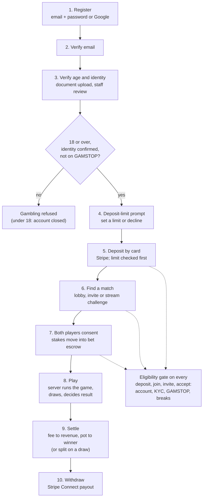
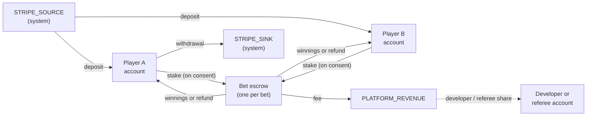

# Document 09 — End-to-End Customer and System Flow

| | |
|---|---|
| **Operator** | [COMPANY NAME], trading as PlayStake |
| **Owner** | [COMPLIANCE LEAD NAME], Head of Compliance (with engineering) |
| **Version** | 0.1 — draft for licence application |
| **Review** | On any change to registration, verification, payments, games or settlement; at least annually |
| **Relates to** | Remote operating licence application: end-to-end diagram including the location of remote gambling equipment; Documents 08 and 10 |

> Draft prepared from the platform as built on 30 September 2026. `[BRACKETS]` must be completed before submission.

## 1. Purpose

This document follows a customer from registration to gambling to getting their money out, showing at each step which system does the work, which checks apply, and where the equipment is. Remote gambling equipment in the sense of the Gambling Act 2005 — the servers that register customers, record stakes, decide results and hold the wallet — is the PlayStake web service, worker service and PostgreSQL database, all hosted by Railway in **[RAILWAY REGION]** (Document 10 §3).

## 2. The journey at a glance

## 3. Step by step

All PlayStake steps run on the web service or worker service with data in PostgreSQL, hosted by Railway in [RAILWAY REGION], unless another location is given.

| Step | What happens | Controls | System and location |
|---|---|---|---|
| **1. Register** | Customer creates an account with email and password, or signs in with Google. Terms, privacy and 18+ confirmed. | Password strength rules; bcrypt hashing; rate limits on registration and sign-in; lockout after repeated failures | Web service (Railway). Google sign-in: Google. |
| **2. Verify email** | A link is emailed. Identity verification can't be started until the email is verified, so nobody can deposit or gamble with an unverified address. | Single-use, expiring token | Email sent through Resend from the worker's outbox |
| **3. Verify age and identity** | Customer enters legal name, date of birth and address and uploads an identity document. Staff review it in the admin console. | Documents encrypted (AES-256-GCM) at rest; under-18 dates of birth refused and the account closed; shared-identity check across accounts; every staff view logged; decision and reason recorded. No deposit, free play or gambling before approval. | Web service + PostgreSQL (Railway). Staff access over HTTPS with 2FA. |
| **3a. GAMSTOP** *(planned)* | The verified identity is checked against GAMSTOP on verification, on sign-in and when a cached result is over 24 hours old. | Registered customers can't gamble; a failed check refuses gambling rather than allowing it | GAMSTOP API (UK) |
| **4. Deposit-limit prompt** | Before the first deposit the customer must set a deposit limit or actively decline. Every six months they are reminded to review limits. | Limits are on gross deposits, per day/week/month; decreases apply at once, increases after 24 hours | Web service (Railway) |
| **5. Deposit** | Customer pays by card on a Stripe form. Stripe confirms payment by signed webhook; the ledger then moves funds from `STRIPE_SOURCE` to the player's account. | Eligibility gate; deposit limits (most restrictive applies); affordability and AML thresholds; webhook signature verified; idempotent ledger transfer | Card entry: Stripe. Webhook handling and ledger: Railway. |
| **6. Find a match** | Customer joins a game lobby and picks a stake, invites or is invited by another player, or challenges a live streamer. The fee and what a win or draw pays are shown before commitment. | Eligibility gate on join, invite and accept, for both players; lobby entries and invites expire | Web service; real-time lobby events through Redis (Railway) |
| **7. Consent and escrow** | Each player explicitly consents. Only then is their stake moved from their account into a per-bet escrow account. | Sufficient-funds check in the same database statement as the debit; no stake taken without consent; unanswered bets expire and refund | Ledger in PostgreSQL (Railway) |
| **8. Play** | `/play` games: the server holds the state, draws every random outcome (CSPRNG) and decides the result; each move and draw is written to an append-only event log. Stream matches: an independent referee decides from both streams. | Clients can't declare results; hidden cards never leave the server; a started match left idle 10 minutes is forfeited by the player to move; an unstarted one is voided and refunded | Game server: web service (Railway). Stream video: Kick. |
| **9. Settle** | The fee goes to `PLATFORM_REVENUE`, any developer or referee share is paid, and the rest of the escrow goes to the winner (or is split on a draw). Escrow must end at exactly zero. | Stream matches settle only after the dispute window; mismatched results open a dispute; settlement worker takes a row lock; daily ledger audit checks every account and transaction balances | Worker service or web service (Railway) |
| **10. Withdraw** | Customer onboards to Stripe Connect Express once, then requests a withdrawal. The ledger debits their balance to `STRIPE_SINK` and Stripe pays out to their bank. | Verified identity required; suspended accounts can't withdraw; self-excluded and GAMSTOP-registered customers **can** withdraw; payout account name to be matched to the verified name | Ledger: Railway. Payout: Stripe. |

## 4. Money flow

Every arrow is one call to the ledger's `transfer()`, which writes one debit and one matching credit and can never leave an account (other than the three system accounts) below zero.

## 5. Where the equipment is

| Component | Provider | Location |
|---|---|---|
| Web service (website, API, game server) | Railway | [RAILWAY REGION] |
| Worker service (settlement, expiry, detection, email, webhooks) | Railway | [RAILWAY REGION] |
| PostgreSQL (all records, ledger, encrypted KYC documents) | Railway | [RAILWAY REGION] |
| Database backups | Railway | [BACKUP LOCATION] |
| Redis (queues, lobby events) | Railway | [RAILWAY REGION] |
| Card processing and payouts | Stripe | Stripe data centres (EU/US) |
| Email delivery | Resend | [RESEND REGION] |
| Error monitoring | Sentry | [SENTRY REGION] |
| Live video | Kick | Kick |

No gambling equipment is located in Great Britain today unless Railway's region is set to one there. The Commission must be told where remote gambling equipment is and of any change (Document 14).

| Version | Date | Change |
|---|---|---|
| 0.1 | 30 September 2026 | First draft |
